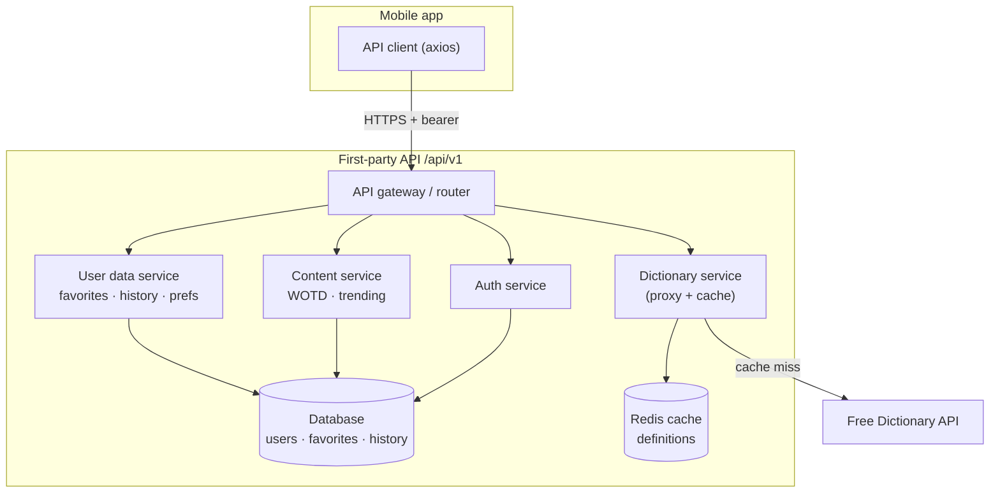

# API Endpoints

## Current (external, third-party)

The app currently has **no backend of its own**. It consumes a single public endpoint.

| Method | Endpoint | Used by | Notes |
| --- | --- | --- | --- |
| `GET` | `https://api.dictionaryapi.dev/api/v2/entries/en/{word}` | `fetchWord()` in `dictionary-api.ts` | 10s timeout. `200`→`WordEntry[]`; `404`/empty→not-found; no-response→network; other→unknown |
| `GET` | `{phonetics[].audio}` (media CDN URLs) | `AudioButton` via expo-audio | Streamed pronunciation clips returned inside the entry payload |

```mermaid
flowchart LR
    App["Mobile app"] -->|GET /entries/en/{word}| FreeAPI["Free Dictionary API"]
    App -->|stream| AudioCDN["Audio CDN"]
```

> The current design is intentionally serverless. The endpoints below are a
> **roadmap** for when the app needs accounts, sync, or features the public API
> can't provide.

---

## Backend endpoints — **to be developed**

Proposed REST surface for a first-party backend (suggested base: `/api/v1`). A
backend lets us proxy/cache the dictionary, add accounts, sync favorites & history
across devices, and serve server-controlled content (word of the day, trending).

### Target architecture



### 1. Dictionary (proxy + enrichment)

| Method | Endpoint | Purpose |
| --- | --- | --- |
| `GET` | `/api/v1/words/{word}` | Definition lookup (server-cached proxy of upstream) |
| `GET` | `/api/v1/words/{word}/audio` | Resolved/normalized pronunciation list |
| `GET` | `/api/v1/search?q={prefix}&limit=` | Autocomplete / typeahead suggestions |
| `GET` | `/api/v1/suggest?q={query}` | Server-side "did you mean?" (spell-correct) |
| `GET` | `/api/v1/random` | Random word (for discovery / practice) |

### 2. Content

| Method | Endpoint | Purpose |
| --- | --- | --- |
| `GET` | `/api/v1/word-of-the-day` | Server-controlled WOTD (replaces local rotation) |
| `GET` | `/api/v1/trending` | Most-looked-up words (uses aggregate history) |

### 3. Auth (optional — only if accounts ship)

| Method | Endpoint | Purpose |
| --- | --- | --- |
| `POST` | `/api/v1/auth/register` | Create account |
| `POST` | `/api/v1/auth/login` | Obtain access/refresh tokens |
| `POST` | `/api/v1/auth/refresh` | Rotate access token |
| `POST` | `/api/v1/auth/logout` | Invalidate session |
| `GET` | `/api/v1/me` | Current user profile |

### 4. Favorites (per-user)

| Method | Endpoint | Purpose |
| --- | --- | --- |
| `GET` | `/api/v1/favorites` | List saved words |
| `POST` | `/api/v1/favorites` | Add `{ word }` |
| `DELETE` | `/api/v1/favorites/{word}` | Remove a saved word |

### 5. History sync (per-user)

| Method | Endpoint | Purpose |
| --- | --- | --- |
| `GET` | `/api/v1/history` | Fetch synced history |
| `POST` | `/api/v1/history` | Append `{ word, searchedAt }` |
| `DELETE` | `/api/v1/history` | Clear history |
| `PUT` | `/api/v1/history/merge` | Reconcile local (AsyncStorage) ↔ server on login |

### 6. Preferences

| Method | Endpoint | Purpose |
| --- | --- | --- |
| `GET` | `/api/v1/preferences` | Theme, accent (US/UK/AU), default language |
| `PUT` | `/api/v1/preferences` | Update preferences |

### Conventions (proposed)
- **Auth:** `Authorization: Bearer <token>` on per-user routes.
- **Errors:** JSON `{ "error": { "kind": "...", "message": "..." } }` mirroring the
  client's existing `DictionaryError` kinds so the UI can reuse error states.
- **Caching:** server caches definitions (e.g. Redis, TTL) to cut upstream calls
  and add resilience if the upstream is down.
- **Pagination:** `?limit=&cursor=` for list endpoints (history, favorites).
- **Versioning:** path-based (`/api/v1`).

### Migration impact on the client
- `dictionary-api.ts` swaps `BASE_URL` to the first-party `/api/v1/words` — the
  `DictionaryError` mapping and cache stay as-is.
- `search-history.tsx` gains a sync path (`PUT /history/merge`) layered over the
  existing AsyncStorage logic (offline-first; AsyncStorage remains the local cache).
