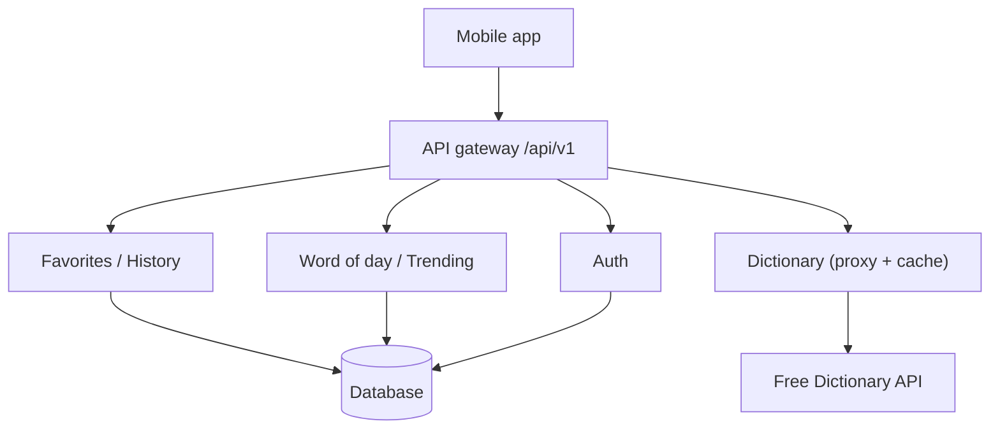

# API Endpoints

## Current (external)

No own backend — the app consumes one public endpoint.

| Method | Endpoint | Used by |
| --- | --- | --- |
| `GET` | `api.dictionaryapi.dev/api/v2/entries/en/{word}` | `fetchWord()` |
| `GET` | `{phonetics[].audio}` (CDN) | `AudioButton` |

Errors map to `DictionaryError.kind`: `404`/empty → `not-found`, no response →
`network`, other status → `unknown`.

## Planned backend

A first-party API (`/api/v1`) enables caching, accounts, and cross-device sync.

### Dictionary

| Method | Endpoint | Purpose |
| --- | --- | --- |
| `GET` | `/words/{word}` | lookup (cached proxy) |
| `GET` | `/search?q=` | autocomplete |
| `GET` | `/suggest?q=` | spell-correct |
| `GET` | `/random` | random word |

### Content

| Method | Endpoint | Purpose |
| --- | --- | --- |
| `GET` | `/word-of-the-day` | server-controlled WOTD |
| `GET` | `/trending` | most-looked-up words |

### Auth

| Method | Endpoint | Purpose |
| --- | --- | --- |
| `POST` | `/auth/register` · `/auth/login` · `/auth/refresh` · `/auth/logout` | sessions |
| `GET` | `/me` | current user |

### Favorites & history (per-user)

| Method | Endpoint | Purpose |
| --- | --- | --- |
| `GET` `POST` `DELETE` | `/favorites` | manage saved words |
| `GET` `POST` `DELETE` | `/history` | synced history |
| `PUT` | `/history/merge` | reconcile local ↔ server on login |

### Preferences

| Method | Endpoint | Purpose |
| --- | --- | --- |
| `GET` `PUT` | `/preferences` | theme, accent, language |

### Conventions

- Bearer tokens on per-user routes.
- Errors mirror `DictionaryError` kinds so the UI reuses its error states.
- Client migration: point `dictionary-api.ts` `BASE_URL` at `/api/v1/words`;
  keep the existing cache + error model. History stays offline-first (AsyncStorage)
  with `PUT /history/merge` layered on top.
