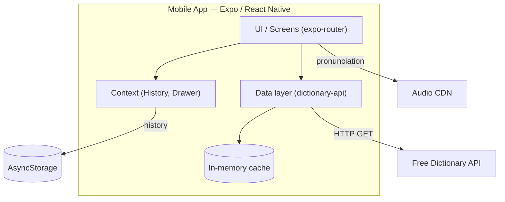
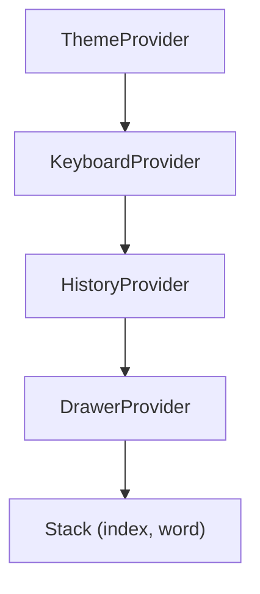

# Architecture

## System

## Layers

| Layer | Role | Files |
| --- | --- | --- |
| Screens | routes, render states | `app/*` |
| Context | shared state | `search-history.tsx`, `drawer-content.tsx` |
| Data | fetch, cache, helpers | `dictionary-api.ts` |
| External | definitions + audio | Free Dictionary API + CDN |

## Provider tree

## Stack

- Expo SDK 54 · React Native 0.81 · React 19
- expo-router 6 · axios · AsyncStorage · expo-audio
- uniwind + Tailwind v4 · lucide icons
- Figtree (display) + Fraunces (reading)

## Notes

- No backend today — thin client over a public API.
- Cache is volatile (cleared on restart); only the history list persists.
- "Did you mean?" suggestions and word-of-the-day are computed on-device.
