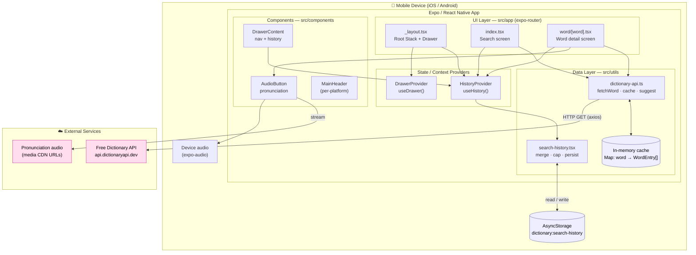
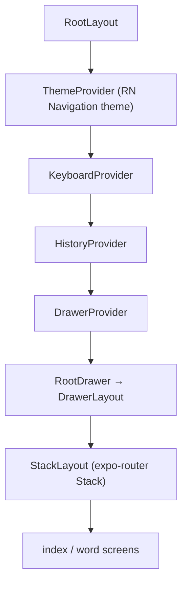

# System Architecture

## High-level architecture

## Layers

| Layer | Responsibility | Key files |
| --- | --- | --- |
| **Navigation / UI** | File-based routes, screen composition, render states | `src/app/_layout.tsx`, `src/app/index.tsx`, `src/app/word/[word].tsx` |
| **Components** | Reusable presentational + interactive UI | `src/components/*` |
| **State** | Cross-screen state via React Context | `HistoryProvider`, `DrawerProvider` |
| **Data** | Network access, normalization, caching, derived helpers | `src/utils/dictionary-api.ts` |
| **Persistence** | Durable history across restarts | `src/utils/search-history.tsx` + AsyncStorage |
| **External** | Definitions + audio (third-party) | Free Dictionary API + media CDN |

## Provider composition (runtime tree)

## Tech stack

- **Framework:** Expo SDK 54, React Native 0.81, React 19
- **Routing:** expo-router 6 (file-based, typed routes)
- **HTTP:** axios (typed responses + `DictionaryError` mapping)
- **Storage:** `@react-native-async-storage/async-storage`
- **Audio:** expo-audio
- **Styling:** uniwind + Tailwind v4, `clsx` / `tailwind-merge`
- **Typography:** Fraunces serif (`@expo-google-fonts/fraunces`)
- **Icons:** lucide-react-native
- **Effects:** expo-blur, expo-glass-effect, react-native-reanimated, gesture-handler

## Architectural notes / constraints

- **No backend today.** The app is a thin client over a public API. Anything
  requiring accounts, sync, or server-side logic is **to be developed**
  (see [api-endpoints.md](./api-endpoints.md)).
- **Cache is volatile.** The lookup cache is a module-level `Map`; it is cleared
  on app restart. Only search _history_ (the list of words) is persisted, not the
  full definitions.
- **Suggestions are on-device.** "Did you mean?" uses Levenshtein distance against
  a bundled common-word list + the user's history — no network call.
- **Word of the day is deterministic & local.** Rotates by day-of-year over a
  curated array; no server involved.
