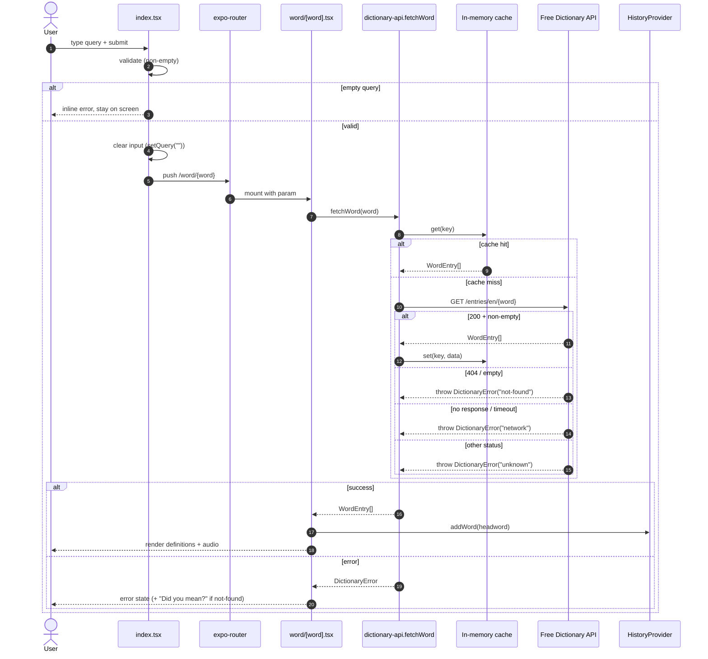
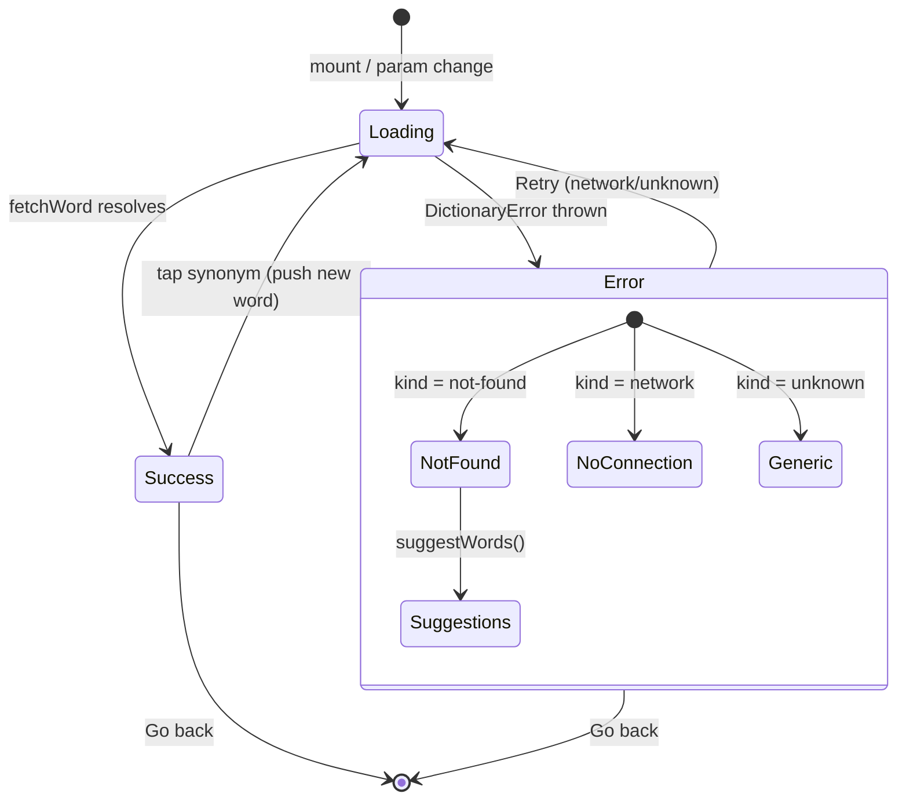
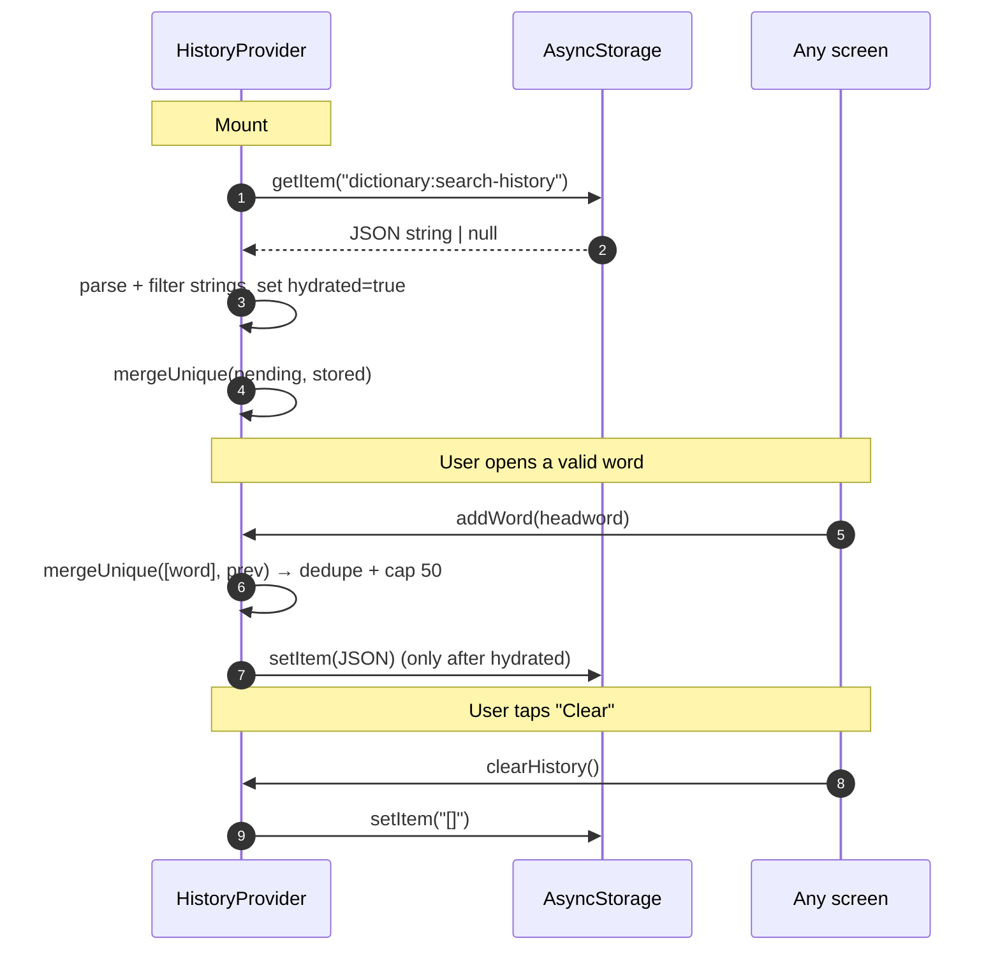
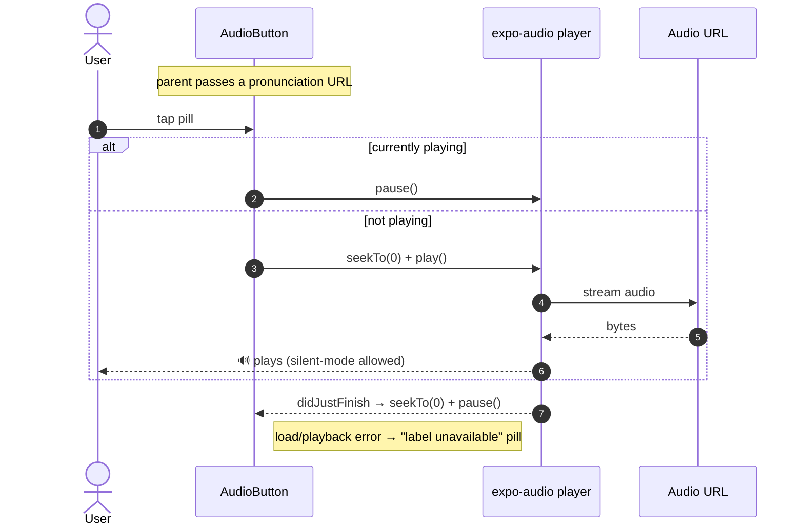
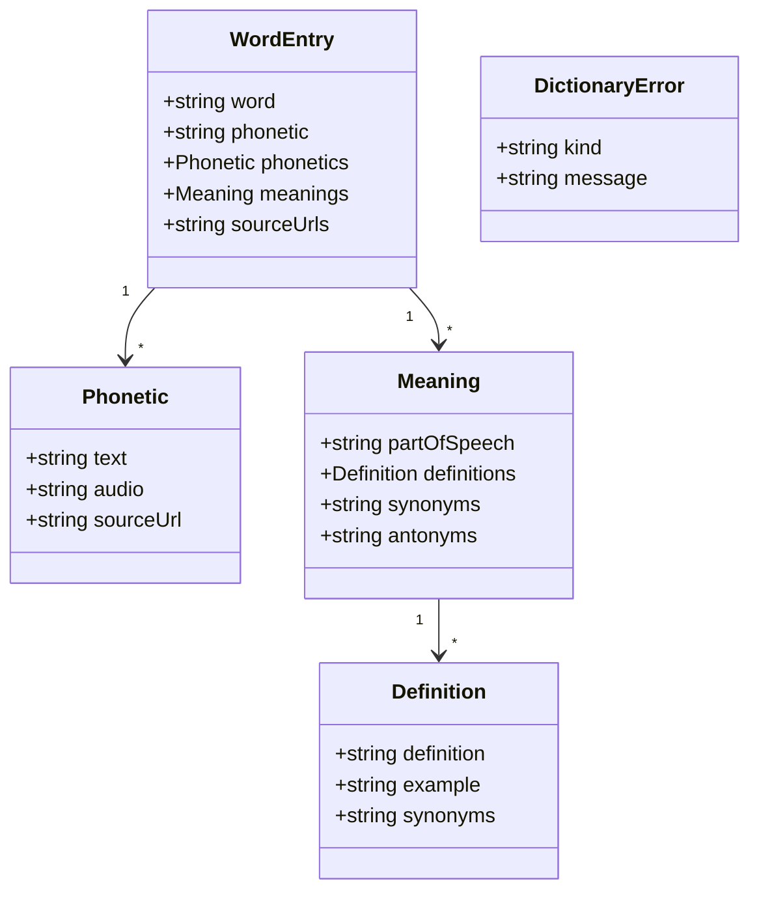

# Data Flow

## 1. Word lookup (search → definition)

The core flow. A query from the search box (or a tapped synonym / history item)
resolves to a rendered definition, with caching and typed error handling.

## 2. Render-state machine (word screen)

## 3. Search history persistence

History is hydrated once on mount and written back to AsyncStorage on every change.
A `hydrated` ref guards against clobbering stored data with the empty initial state.

### `mergeUnique` rules
- Trims, drops empties.
- Case-insensitive dedupe; **first** occurrence wins (most recent in front).
- Capped at `MAX_HISTORY = 50`.

## 4. Pronunciation audio

## 5. Data shapes

> Cardinality (`1 → *`) marks array fields (`phonetics`, `meanings`, `definitions`,
> `synonyms`). All fields except `word`, `partOfSpeech`, and `definition` are
> optional. `DictionaryError.kind` ∈ `empty | not-found | network | unknown`.
