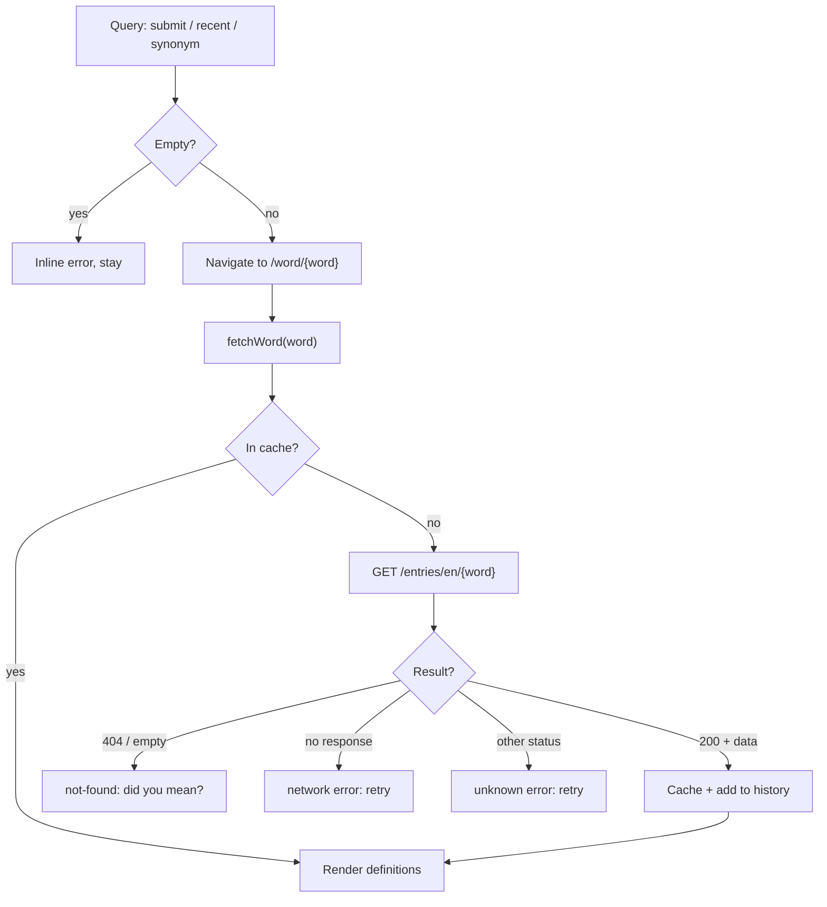
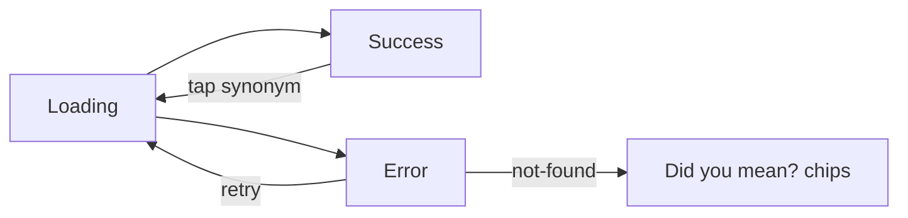
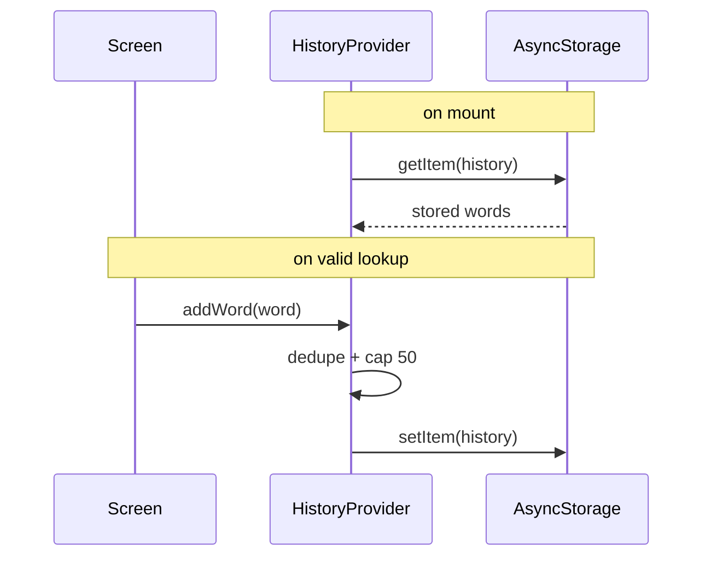
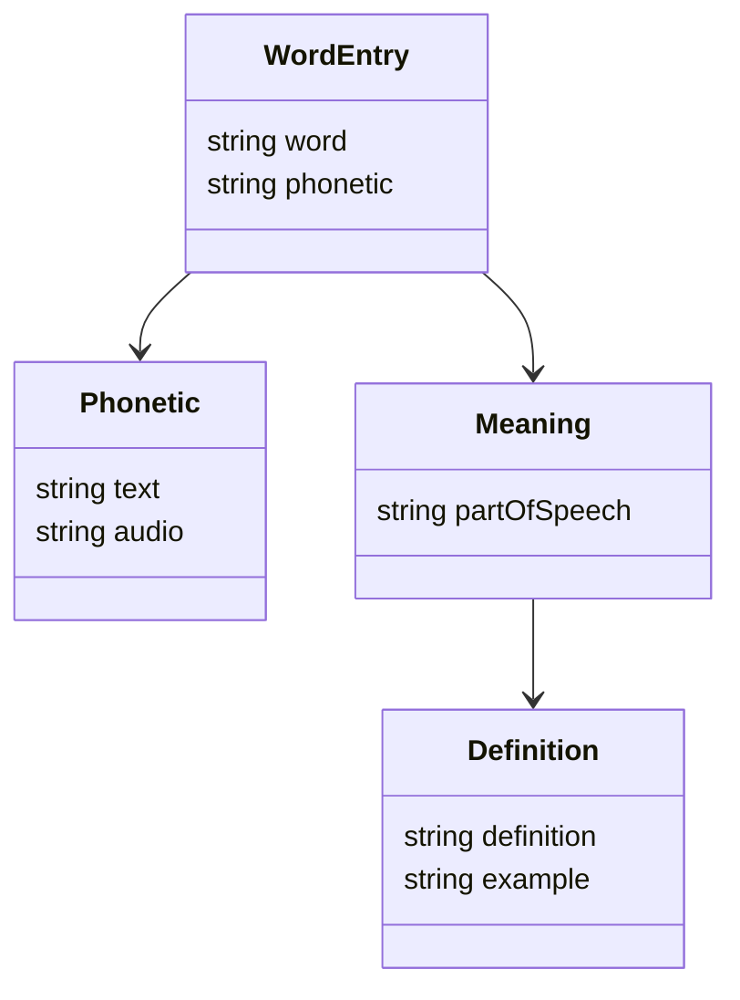

# Data Flow

## Word lookup

## Word screen states

## History persistence

## Data shapes

- `WordEntry` has many `phonetics` and `meanings`; each `Meaning` has many
  `definitions` plus optional `synonyms` / `antonyms`.
- Errors are typed: `kind` ∈ `empty · not-found · network · unknown`.
