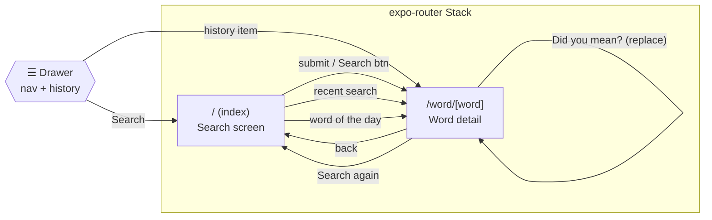
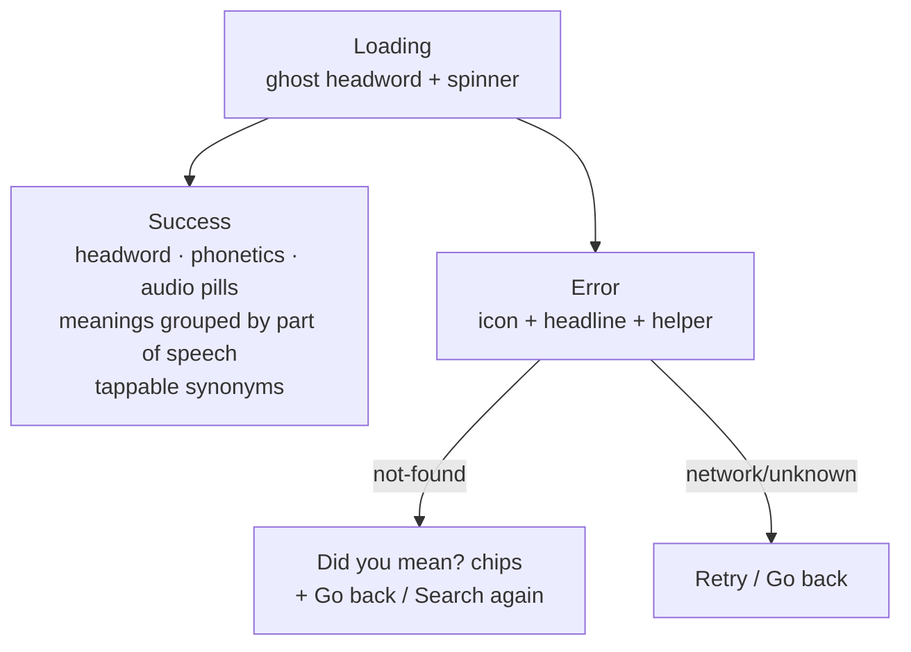
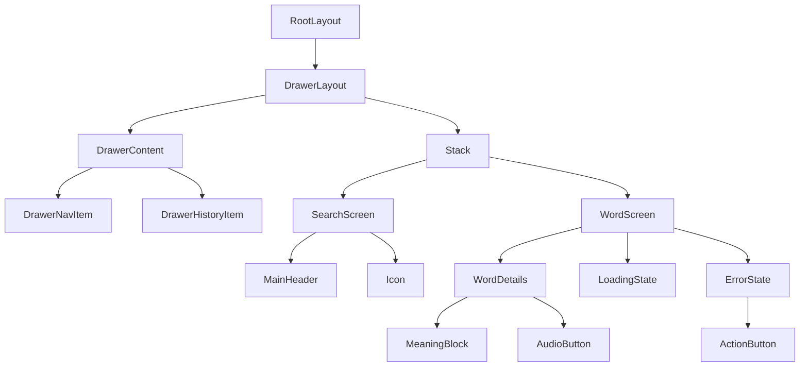

# Design — Navigation, Screens & Components

## Navigation map



## Screen: Search (`index.tsx`) — _Current_

```
┌──────────────────────────────┐
│ ☰                            │  ← MainHeader (drawer button)
│  📖                          │
│  Dictionary                  │  ← Hero
│  Look up any word…           │
│ ┌──────────────────────────┐ │
│ │ 🔍  Search a word        │ │  ← TextInput (clears on submit)
│ └──────────────────────────┘ │
│ [        Search        ]     │  ← primary button
│                              │
│ RECENT SEARCHES      Clear   │  ← from useHistory()
│ 🕐 serendipity            ›  │
│ 🕐 ephemeral              ›  │
│                              │
│ WORD OF THE DAY              │
│ ┌──────────────────────────┐ │
│ │ petrichor  noun          │ │  ← deterministic, local
│ │ A pleasant, earthy smell…│ │
│ └──────────────────────────┘ │
└──────────────────────────────┘
```

Behaviors: empty-query inline validation, `Keyboard.dismiss()` + input clear on
submit, history-driven recents, tappable word-of-the-day.

## Screen: Word detail (`word/[word].tsx`) — _Current_

Three render states driven by the fetch lifecycle:



## Component tree



## Design system tokens

| Token | Usage |
| --- | --- |
| `bg-background` / `text-foreground` | Base surface + text |
| `bg-secondary` / `bg-muted` | Cards, pills, pressed states |
| `text-muted-foreground` | Secondary text, captions |
| `border-continuous` | iOS-style continuous-corner borders |
| Fraunces serif | Headwords / display type |

- **Theme:** follows system light/dark via `useColorScheme` + RN Navigation theme.
- **Safe areas:** `react-native-safe-area-context`; iOS uses
  `contentInsetAdjustmentBehavior`, Android folds in `insets.bottom` manually.
- **Platform headers:** `main-header.ios.tsx` / `.android.tsx` / `.fallback.tsx`
  with optional liquid-glass effect when available.

## Screens to be developed

See [pages.md](./pages.md) for the full roadmap (Favorites, Settings, Onboarding,
Search results/autocomplete, Practice/Quiz, About).
