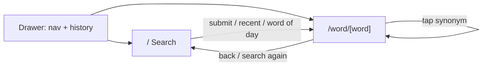
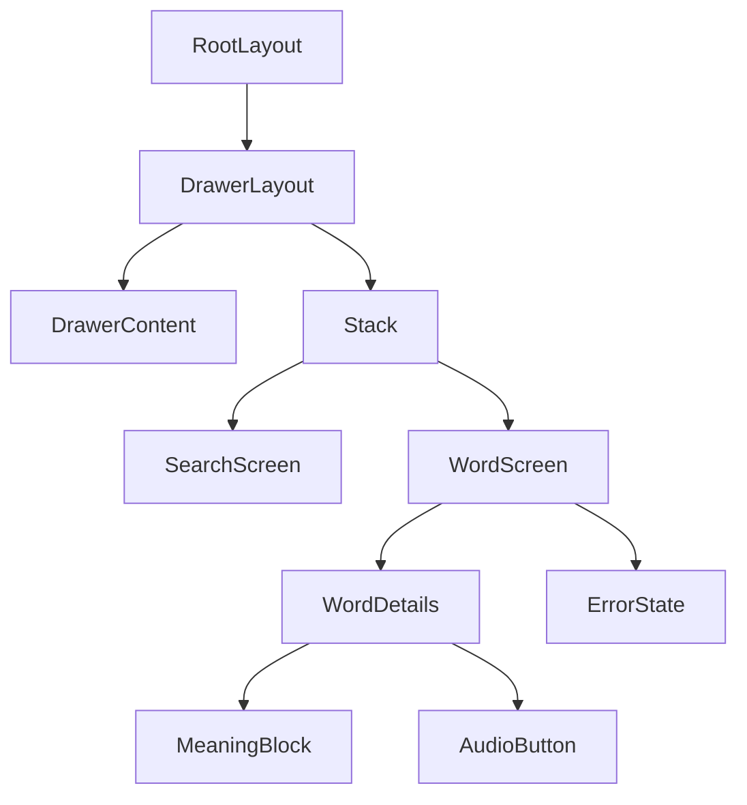

# Design

## Navigation

## Screens

| Screen | Purpose | States |
| --- | --- | --- |
| Search (`index.tsx`) | hero, search box, recents, word of day | input / validation error |
| Word detail (`word/[word].tsx`) | meanings, phonetics, audio, synonyms | loading / success / error |
| Drawer (`drawer-content.tsx`) | Search nav + persisted history | empty / populated |

## Component tree

## Tokens

| Token | Usage |
| --- | --- |
| `bg-background` / `text-foreground` | base surface + text |
| `bg-secondary` / `bg-muted` | cards, pills, pressed states |
| `text-muted-foreground` | secondary text, captions |
| `border-continuous` | iOS continuous-corner borders |
| Figtree | display type (title, headwords) |
| Fraunces | reading type (definitions, examples) |

- Theme follows system light/dark.
- Safe areas via `react-native-safe-area-context`; platform-specific headers
  (`main-header.ios` / `.android` / `.fallback`) with optional liquid glass.
