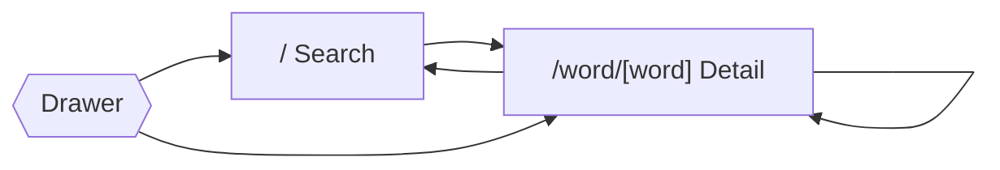
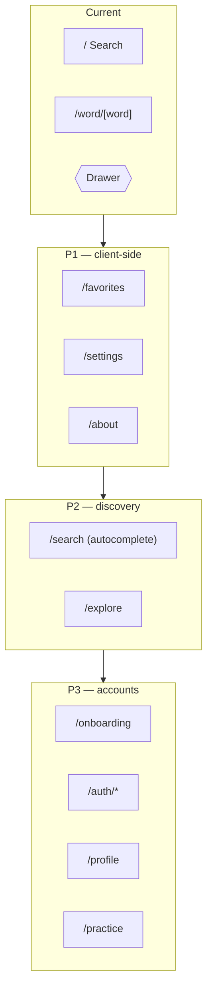

# Pages / Screens

## Current screens

| Route | File | Purpose | States |
| --- | --- | --- | --- |
| `/` | `src/app/index.tsx` | Search home — hero, search box, recent searches, word of the day | input / validation error |
| `/word/[word]` | `src/app/word/[word].tsx` | Word detail — meanings, phonetics, audio, synonyms | loading / success / error (not-found · network · unknown) |
| _(overlay)_ | `src/components/drawer-content.tsx` | Side drawer — Search nav + persisted history | empty / populated |



---

## Pages to be developed

Prioritized roadmap. Each entry lists the proposed route, dependencies, and the
backend endpoints it would consume (see [api-endpoints.md](./api-endpoints.md)).

### P1 — High value, low effort (mostly client-side)

| Route | Screen | Description | Depends on |
| --- | --- | --- | --- |
| `/favorites` | **Favorites** | Saved/bookmarked words; star toggle on word screen | Local (AsyncStorage) now; `GET/POST/DELETE /favorites` when synced |
| `/settings` | **Settings** | Theme (system/light/dark), preferred accent (US/UK/AU), clear data | Local; later `GET/PUT /preferences` |
| `/about` | **About** | App info, data-source attribution, licenses, version | None |

### P2 — Needs autocomplete / discovery

| Route | Screen | Description | Depends on |
| --- | --- | --- | --- |
| `/search` | **Search results / autocomplete** | Live typeahead as the user types (vs. submit-to-navigate today) | `GET /search?q=`, `GET /suggest?q=` |
| `/explore` | **Explore / Discover** | Trending words, random word, themed collections | `GET /trending`, `GET /random`, `GET /word-of-the-day` |

### P3 — Accounts & engagement

| Route | Screen | Description | Depends on |
| --- | --- | --- | --- |
| `/onboarding` | **Onboarding** | First-run intro + permissions/preferences | None |
| `/auth/login`, `/auth/register` | **Auth** | Sign in / sign up for cross-device sync | `POST /auth/*` |
| `/profile` | **Profile** | Account, synced history/favorites, sign out | `GET /me`, `GET /history`, `GET /favorites` |
| `/practice` | **Practice / Quiz** | Flashcards or quizzes from favorites & history | `GET /favorites`, `GET /random` |

### Roadmap overview



### Proposed expanded source layout

```
src/app/
├─ _layout.tsx
├─ index.tsx                 # Search (current)
├─ word/[word].tsx           # Detail (current)
├─ favorites.tsx             # P1
├─ settings.tsx              # P1
├─ about.tsx                 # P1
├─ search.tsx                # P2 (autocomplete)
├─ explore.tsx              # P2
├─ onboarding.tsx            # P3
├─ profile.tsx              # P3
├─ practice.tsx             # P3
└─ auth/
   ├─ login.tsx              # P3
   └─ register.tsx           # P3
```

### Cross-cutting work these unlock
- **Favorites context** mirroring `HistoryProvider` (AsyncStorage-backed, offline-first).
- **Preferences context** for theme/accent, persisted locally and optionally synced.
- **API client refactor** to point `dictionary-api.ts` at the first-party backend
  while keeping the existing cache + `DictionaryError` model.
