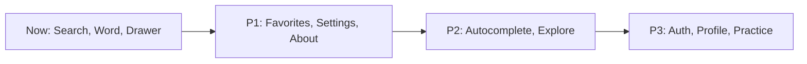

# Pages

## Current

| Route | File | Purpose |
| --- | --- | --- |
| `/` | `index.tsx` | search home — hero, search, recents, word of day |
| `/word/[word]` | `word/[word].tsx` | word detail — meanings, audio, synonyms |
| _(overlay)_ | `drawer-content.tsx` | drawer — Search nav + history |

## Roadmap

### Planned screens

| Pri | Route | Screen | Depends on |
| --- | --- | --- | --- |
| P1 | `/favorites` | saved/bookmarked words | local now; `/favorites` when synced |
| P1 | `/settings` | theme, accent, clear data | local; later `/preferences` |
| P1 | `/about` | info, attribution, version | none |
| P2 | `/search` | live autocomplete | `/search`, `/suggest` |
| P2 | `/explore` | trending, random, collections | `/trending`, `/random` |
| P3 | `/onboarding` | first-run intro | none |
| P3 | `/auth/login` `/auth/register` | sign in / up | `/auth/*` |
| P3 | `/profile` | account, synced data, sign out | `/me`, `/history`, `/favorites` |
| P3 | `/practice` | flashcards / quiz | `/favorites`, `/random` |

### Unlocks

- Favorites + Preferences contexts mirroring `HistoryProvider` (offline-first).
- API client refactor to the first-party backend (see
  [api-endpoints.md](./api-endpoints.md)), keeping the current cache + error model.
